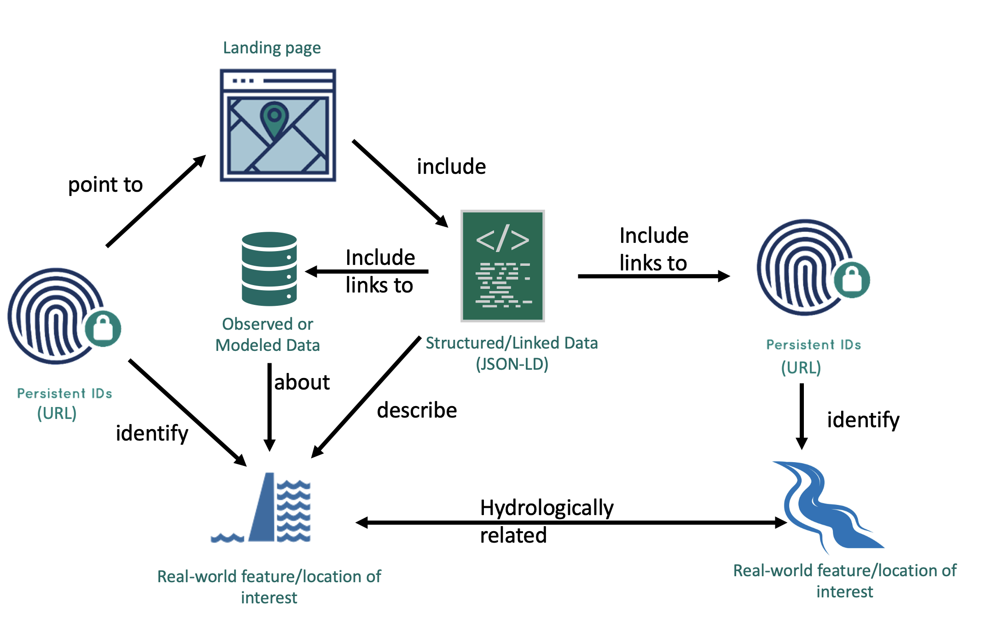

# What is Geoconnex?

The Geoconnex project provides technical infrastructure and guidance for creating an open, community-contribution model for a knowledge graph linking hydrologic features in the United States, published in accordance with [Spatial Data on the Web best practices](https://www.w3.org/TR/sdw-bp/) as an implementation of [Internet of Water](https://github.com/opengeospatial/SELFIE/blob/master/docs/demo/internet_of_water.md) principles.

In short, Geoconnex aims to make water data as easily discoverable, accessible, and usable as possible. 

The Geoconnex knowledge graph is located at [https://graph.geoconnex.us](https://graph.geoconnex.us) and its value can be illustrated considering two use cases:

1. Indexing and discovering models and research from public sector, private sector, or academic projects about a particular place or environmental feature.  
2. Building a federated multi-organization monitoring network in which all member-systems reference common monitored features and are discoverable through a community index.

:::tip 

See the [access data section](../access/overview.md) for examples of the data discovery and access workflows that Geoconnex enables.

:::

The development of geoconnex.us takes place on GitHub. See [here](./system-architecture/repositories.md) for the system of repositories.

## How the Graph is Populated

1. An partner organization creates an endpoint for their water data and associates a list of persistent identifiers with their endpoints
2. The organization submits a pull request or submits the form at [register.geoconnex.us](https://register.geoconnex.us/) to upload their data
3. The Geoconnex harvester finds the endpoints via their published PIDs and downloads the JSON-LD for each endpoint
4. Using the JSON-LD data, the Geoconnex crawler produces [semantic triples](https://en.wikipedia.org/wiki/Semantic_triple) in the [PROV Ontology](https://www.w3.org/TR/prov-o/) 
5. The Geoconnex crawler populates the Geoconnex graph database