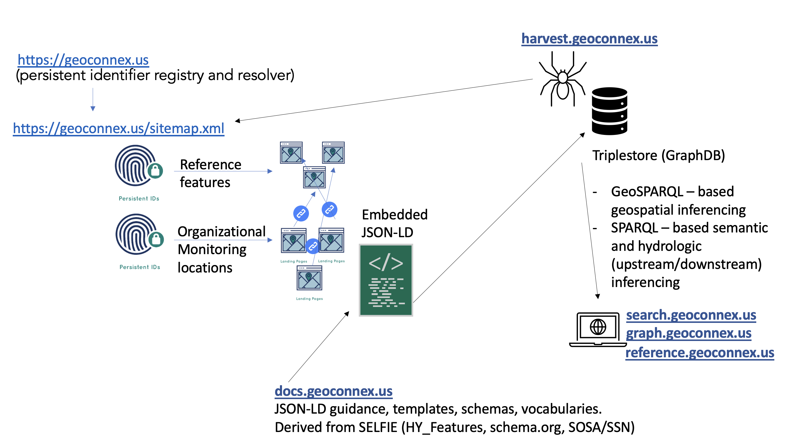

# Overview of Geoconnex Architecture

## System Components within geoconnex.us

The Geoconnex.us system includes multiple infrastructural components that are each necessary to achieve a robust, queryable, and stable knowledge graph for water data.

1. **The Persistent Identifier Registry** helps data publishers mint persistent identifiers and create a system that is stable, even if the underlying resources change
2. **The Sitemap** of all identifiers to allows a crawler to easily traverse all websites in the network
3. **The Harvester** collects structured data so that it can be exported as knowledge graph triplets
4. **The Knowledge Graph** allows data users to interact with linked data through a search interfaces

## Populating the Graph

The Geoconnex knowledge graph is populated by the following process:

1. An organization creates an endpoint for their water data and associates a list of persistent identifiers with their endpoints
2. The organization submits a pull request or submits the form at [register.geoconnex.us](https://register.geoconnex.us/) to upload their data
3. The Geoconnex harvester finds the endpoints via their published PIDs and downloads the JSON-LD for each endpoint
4. Using the JSON-LD data, the Geoconnex crawler produces [semantic triples](https://en.wikipedia.org/wiki/Semantic_triple) in the [PROV Ontology](https://www.w3.org/TR/prov-o/) 
5. The Geoconnex crawler populates the Geoconnex graph database

## A Visual Representation of the Geoconnex Architecture
