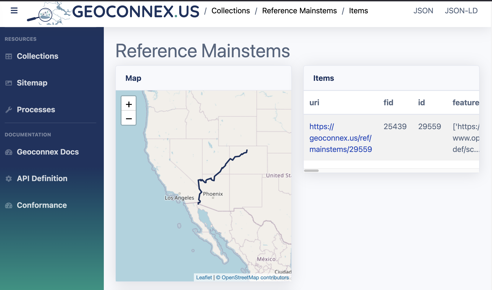

# Mainstem Association

As shown in the [SPARQL Playground](../../playground/sparql.md), one of the core query patterns in Geoconnex is finding features and their associated datasets on a particular [mainstem](https://en.wikipedia.org/wiki/Main_stem).

In order to accomplish this, Geoconnex uses the hydrological info from the [National Hydrography Dataset Plus (NHDPlus)](https://www.epa.gov/waterdata/get-nhdplus-national-hydrography-dataset-plus-data) to associate vector features with their mainstem river. This dataset is a subset of the NHDPlusV2.1 within the lower 48 states which fixes geometry issues with the original NHDPlusV2.1 dataset.

:::note

NHDPlus is distinct from NHDPlus HR which is a higher resolution dataset. The reference hydrofabric will eventually be updated to use NHDPlus HR, but is currently using NHDPlus V2.1. 

:::

The general pattern to find the mainstem for a feature is as follows:

1. Get the geometry of your feature of interest
2. Find the NHDPlus [catchment](https://en.wikipedia.org/wiki/Drainage_basin) 
3. Find the associated flowlines from the catchment
4. Traverse the flowlines until you reach the terminal flowline
5. Map the terminal flowline to the Geoconnex mainstem feature persistent identifier (PID)

There are two main ways of reproducing these associations. These can be used to generate hydrological reference associations for other future hydrography products beyond Geoconnex.

import Tabs from '@theme/Tabs';
import TabItem from '@theme/TabItem';

<Tabs groupId="lang">

<TabItem value="local" label="Using local NHDPlus Data" default>
## Generating Mainstem Associations Using Local NHDPlus Data 


The Python notebook below demonstrates an example of how to map an arbitrary point to its associated Geoconnex mainstem. It requires you have the reference hydrofabric dataset downloaded from ScienceBase [here](https://www.sciencebase.gov/catalog/item/61295190d34e40dd9c06bcd7)
```py
# %%
from pathlib import Path
import geopandas as gpd
import shapely

# %%
# Read in the geopackage files; these can be downloaded from 
# https://www.sciencebase.gov/catalog/item/61295190d34e40dd9c06bcd7
catchments =  gpd.read_file(Path(__file__).parent / "reference_catchments.gpkg")
flowlines = gpd.read_file(Path(__file__).parent / "reference_flowline.gpkg")

# %% 
# Project catchments to the same coordinate system
catchments = catchments.to_crs("epsg:4326")
assert catchments.crs == "epsg:4326", catchments.crs
flowlines = flowlines.to_crs("epsg:4326")
assert flowlines.crs == "epsg:4326", flowlines.crs

# %%  
# First we get the featureid for the catchment. This is a catchment id aka COMID
pointOnColoradoRiver = shapely.geometry.Point(-108.50231860661755, 39.05108882481538)
associatedCatchment = catchments[catchments.intersects(pointOnColoradoRiver)]
featureID = associatedCatchment["featureid"].iloc[0]
assert featureID == 3185828

# %%
# Next we get the associated flowline(s) for the catchment
relevantFlowline = (flowlines[flowlines["COMID"] == featureID])
assert relevantFlowline.shape[0] == 1
assert relevantFlowline["gnis_name"].iloc[0] == "Colorado River"
assert relevantFlowline["gnis_id"].iloc[0] == 45730

# The terminal path is the last segment of the flowline (aka the mainstem)
TERMINAL_PATH = "TerminalPa"
terminalPathID = relevantFlowline[TERMINAL_PATH].iloc[0]
assert terminalPathID == 308280

# %%
# Finally we use the id of the terminal path to find the associated geoconnex mainstem
mainstem_lookup = gpd.read_file(
    "https://github.com/internetofwater/ref_rivers/releases/download/v2.1/mainstem_lookup.csv"
)
# The mainstem lookup CSV uses strings instead of integers so we cast
mainstem_lookup["lp_mainstem"] = mainstem_lookup["lp_mainstem"].astype(int)
mainstem_lookup["ref_mainstem_id"] = mainstem_lookup["ref_mainstem_id"].astype(int)

geoconnex_mainstem_id =mainstem_lookup.loc[mainstem_lookup["lp_mainstem"] == terminalPathID]["ref_mainstem_id"].iloc[0]

assert geoconnex_mainstem_id == 29559

# The point POINT (-108.50231860661755 39.05108882481538) is associated with the mainstem https://reference.geoconnex.us/collections/mainstems/items/29559
print(f"The point {pointOnColoradoRiver} is associated with the mainstem https://reference.geoconnex.us/collections/mainstems/items/{geoconnex_mainstem_id}")
```


</TabItem>

<TabItem value="nldi" label="Using the NLDI API" default>

## Generating Mainstem Associations Using the USGS NLDI

The NLDI is an API service provided by the USGS. It takes a watershed outlet identifier as a starting point, a navigation mode to perform, and the type of data desired in response to the request. It can provide geospatial representations of the navigation or linked data sources found along the navigation.

One can find the associated mainstem for a point by following this workflow:

1. Obtain the geometry of your feature of interest
2. Find which catchment it falls into
    - Fill in your geometry to the bbox argument: https://labs-beta.waterdata.usgs.gov/api/fabric/pygeoapi/collections/catchmentsp/items?bbox=$GEOMETRY
    - _Example_: https://labs-beta.waterdata.usgs.gov/api/fabric/pygeoapi/collections/catchmentsp/items?limit=100&bbox=-108.50231860661755,39.05108882481538,-108.50231860661755,39.05108882481538
        - For polygons which intersect multiple catchments, you will need to determine which catchment is the best fit for your feature.

3. Use the `featureid` from step 2 to fetch the flowlines data:
    - Replace $FEATUREID with your feature: https://api.water.usgs.gov/nldi/linked-data/comid/$FEATUREID/navigation/UM/flowlines?f=json&distance=3000
    - _Example_: https://api.water.usgs.gov/nldi/linked-data/comid/3185828/navigation/UM/flowlines?f=json&distance=3000
4. Get the value of `nhdplus_comid` for the **last** feature in the returned feature collection
    - The last feature is the most upstream feature according to the NHDPlus dataset
    - _Value from Example:_ `1233891`
5. Use the value of `nhdplus_comid` to find the associated mainstem in the Geoconnex reference feature server. 
    - **Note**: Make sure to include the full Geoconnex PID in the query
    - _Example_: https://reference.geoconnex.us/collections/mainstems/items?head_nhdpv2_comid=https://geoconnex.us/nhdplusv2/comid/1233891
6. If there is an associated mainstem, you will get the returning mainstem feature
    - In this case, the Colorado River


</TabItem>

</Tabs>