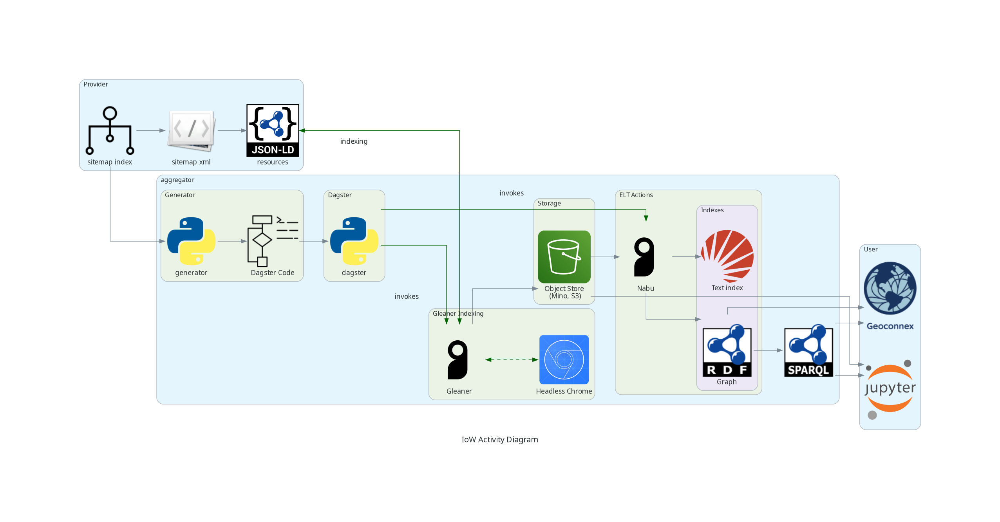

# Software Stack

## Metadata Harvesting 

Harvesting metadata to construct the Geoconnex graph is accomplished by the integration of three main components. These are heavily modified forks of programs by the same name from the [gleanerio project](https://github.com/gleanerio/). These services are generalized and could be ran to construct other knowledge graphs in addition to Geoconnex.

1. [Gleaner](https://github.com/internetofwater/gleaner/): a web crawler CLI program written in go
    - Crawls partner websites as specified in the Geoconnex sitemap: [geoconnex.us/sitemap.xml](https://geoconnex.us/sitemap.xml)
    - Fetches JSON-LD data and outputs it in a S3-compliant storage bucket
2. [Nabu](https://github.com/internetofwater/nabu): a graph sync CLI program written in go
    - Ensures that a graph database is in sync with a S3 storage bucket by dropping old named graphs and generating new ones
3. [Scheduler](https://github.com/internetofwater/scheduler): a data orchestrator written with [Dagster](https://dagster.io/) and Python
    - Launches gleaner and nabu jobs for each source on a set interval and logs their runs
    - Handles automatic exports of the final Geoconnex graph to partner organizations

All of these programs are open source and accept community contributions. They all can be ran either locally or in the cloud. For a full end-to-end cloud deployment with Terraform, see [harvest.geoconnex.us](https://github.com/internetofwater/harvest.geoconnex.us)

