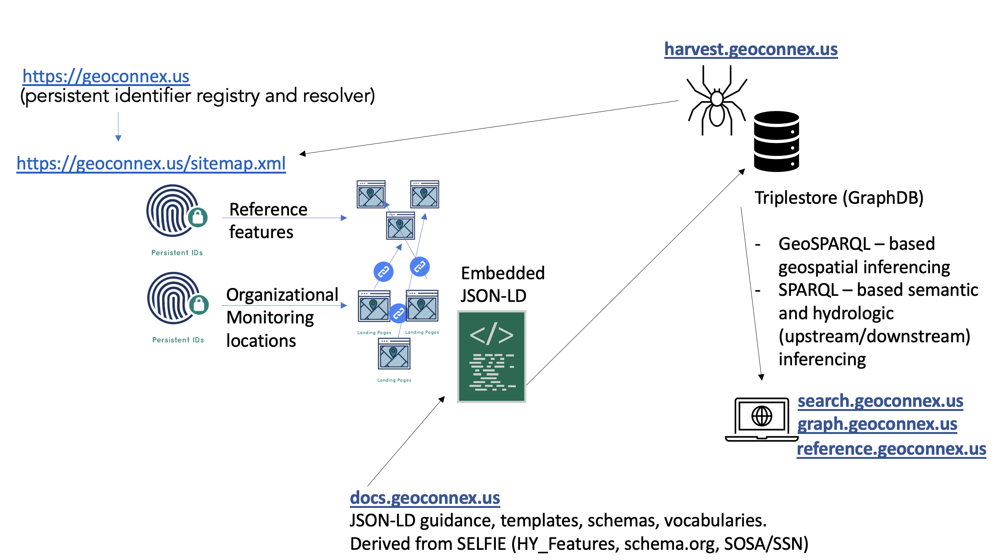

# Technical Architecture

## System Components within geoconnex.us

The Geoconnex.us system includes multiple infrastructural components that are each necessary to achieve a robust, queryable, and stable knowledge graph for water data.

1. **The Persistent Identifier Registry** helps data publishers mint persistent identifiers and create a system that is stable, even if the underlying resources change
2. **The Sitemap** of all identifiers to allows a crawler to easily traverse all websites in the network
3. **The Harvester** collects structured data so that it can be exported as knowledge graph triplets
4. **The Knowledge Graph** allows data users to interact with linked data through a search interfaces

## Populating the Graph

The Geoconnex knowledge graph is populated by the following process:

1. An organization creates an endpoint for their water data and associates a list of persistent identifiers with their endpoints
2. The organization submits a pull request or submits the form at [register.geoconnex.us](https://register.geoconnex.us/) to upload their data
3. The Geoconnex harvester finds the endpoints via their published PIDs and downloads the JSON-LD for each endpoint
4. Using the JSON-LD data, the Geoconnex crawler produces [semantic triples](https://en.wikipedia.org/wiki/Semantic_triple) in the [PROV Ontology](https://www.w3.org/TR/prov-o/) 
5. The Geoconnex crawler populates the Geoconnex graph database

## A Visual Representation of the Geoconnex Architecture

## Geoconnex Repositories

### Software, infrastrucure, and documentation

| Repo name| Description |
|-------------|-------------|
| [geoconnex.us](https://github.com/internetofwater/geoconnex.us) | PID registry for hydrologic, environmental, and administrative features |
| [register.geoconnex.us](https://github.com/internetofwater/register.geoconnex.us) | Helper web application for submitting PIDs to Geoconenx without a GitHub account |
| [about.geoconnex.us](https://github.com/internetofwater/about.geoconnex.us) | An overview of all geoconnex repos | 
| [pids.geoconnex.us](https://github.com/internetofwater/pids.geoconnex.us) | Development and deployment of PID server, database, and sitemap.xml assets |
| [harvest.geoconnex.us](https://github.com/internetofwater/harvest.geoconnex.us) | Customization and deployment of gleaner for harvesting linked data |
| [docs.geoconnex.us](https://github.com/internetofwater/docs.geoconnex.us) | Developing best practices and guidance for data publishers |
| [reference.geoconnex.us](https://github.com/internetofwater/reference.geoconnex.us) | Community reference features using OGC API Features |

### Reference feature development (i.e. data curation)

| Repo Name | Description |
|-----------|-------------|
| [internetofwater/ref_gages](https://github.com/internetofwater/ref_gages) | Developing the reference gages dataset available at https://reference.geoconnex.us/collections/gages |
| [internetofwater/ref_dams](https://github.com/internetofwater/ref_dams) | Developing the reference gages dataset available at https://reference.geoconnex.us/collections/dams |