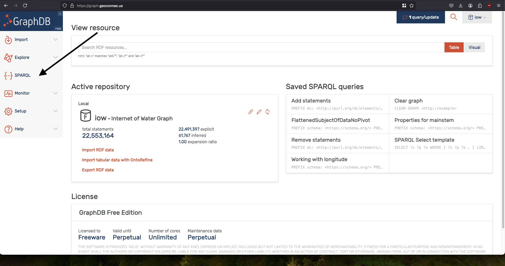

# Querying with Sparql

The RDF query language Sparql can be used to query the graph endpoint at https://graph.geoconnex.us/ 

This functionality remains in active development and there are future plans for simplified querying. 

## An Example Query

import Tabs from '@theme/Tabs';
import TabItem from '@theme/TabItem';

This query returns all locations and datasets associated with a given mainstem. Because of the fact that the geoconnex graph uses standard ontologies and linked data, we can also return a variety of other properties like the dataset description, temporal coverage, etc.

<Tabs>
  <TabItem value="query" label="Create the Query" default>
  ```sparql
## Prefixes define what ontologies can be used in our query predicates
PREFIX schema: <https://schema.org/>
PREFIX gsp: <http://www.opengis.net/ont/geosparql#>
PREFIX wiki: <https://www.wikidata.org/wiki/>
PREFIX hyf: <https://www.opengis.net/def/schema/hy_features/hyf/>
PREFIX xsd: <http://www.w3.org/2001/XMLSchema#>
PREFIX rdf: <http://www.w3.org/1999/02/22-rdf-syntax-ns#>

# Specify which of the query results we want to return to the user
SELECT DISTINCT 
?mainstem 
?monitoringLocation 
?siteName 
?datasetDescription 
?type
?url
?variableMeasured
?variableUnit
?measurementTechnique
?temporalCoverage
?distributionName
?distributionURL
?distributionFormat
?wkt
WHERE {
    # limit results to just one mainstem
    VALUES ?mainstem { <https://geoconnex.us/ref/mainstems/29559> }
    
    # location info
    ?monitoringLocation hyf:HydroLocationType ?type;
    		      hyf:referencedPosition/hyf:HY_IndirectPosition/hyf:linearElement ?mainstem;
                        schema:subjectOf ?dataset;
                        gsp:hasGeometry/gsp:asWKT ?wkt .

    # dataset info
    ## NOTE: we don't return ?dataset but use it as a variable to group all the metadata together
    ## otherwise in sparql it is possible to accidentally create a cross-product of each
    ?dataset  schema:variableMeasured ?var;
              schema:url ?url;
              schema:distribution ?distribution;
              schema:description ?datasetDescription;
              schema:temporalCoverage ?temporalCoverage;
              schema:name ?siteName.
    
    # variable metadata
    ## NOTE: just like ?dataset we don't return ?var
    ?var schema:name ?variableMeasured;
         schema:unitText ?variableUnit;
         schema:measurementTechnique ?measurementTechnique.
    
    # Dataset distribution / download info
    ## NOTE: just like ?dataset we don't return ?distribution
    ?distribution schema:name ?distributionName;
                  schema:contentUrl ?distributionURL;
                  schema:encodingFormat ?distributionFormat.
  
}
# We limit 10 for the sake of brevity
LIMIT 10
```
  </TabItem>
  <TabItem value="editor" label="Send a Query Graphically">
  Navigate to the [Sparql Editor](https://graph.geoconnex.us/sparql) on the sidebar.
   [](https://graph.geoconnex.us/sparql)
   Paste your query and click "run". 
  Results are then output as a table that can be exported in a variety of formats such as CSV or JSON.
  
  </TabItem>

    <TabItem value="cli" label="Send a Query via CLI">

    The Geoconnex graph database provides a RDF4J API that is documented [here](https://graph.geoconnex.us/webapi). With this API, you can run sparql queries from the command line or any client that can send HTTP requests.

    The example below shows how we can read in the sparql query, encode it to be in the proper format, and send it to the API via curl.

    ```sh
#!/bin/bash

# Define the SPARQL query
read -r -d '' SPARQL_QUERY << EOM
## Prefixes define what ontologies can be used in our query predicates
PREFIX schema: <https://schema.org/>
PREFIX gsp: <http://www.opengis.net/ont/geosparql#>
PREFIX wiki: <https://www.wikidata.org/wiki/>
PREFIX hyf: <https://www.opengis.net/def/schema/hy_features/hyf/>
PREFIX xsd: <http://www.w3.org/2001/XMLSchema#>
PREFIX rdf: <http://www.w3.org/1999/02/22-rdf-syntax-ns#>

# Specify which of the query results we want to return to the user
SELECT DISTINCT 
?mainstem 
?monitoringLocation 
?siteName 
?datasetDescription 
?type
?url
?variableMeasured
?variableUnit
?measurementTechnique
?temporalCoverage
?distributionName
?distributionURL
?distributionFormat
?wkt
WHERE {
  # limit results to just one mainstem
  VALUES ?mainstem { <https://geoconnex.us/ref/mainstems/29559> }
  
  # location info
  ?monitoringLocation hyf:HydroLocationType ?type;
                      hyf:referencedPosition/hyf:HY_IndirectPosition/hyf:linearElement ?mainstem;
                      schema:subjectOf ?dataset;
                      gsp:hasGeometry/gsp:asWKT ?wkt .

  # dataset info
  ## NOTE: we don't return ?dataset but use it as a variable to group all the metadata together
  ## otherwise in sparql it is possible to accidentally create a cross-product of each
  ?dataset  schema:variableMeasured ?var;
            schema:url ?url;
            schema:distribution ?distribution;
            schema:description ?datasetDescription;
            schema:temporalCoverage ?temporalCoverage;
            schema:name ?siteName.
  
  # variable metadata
  ## NOTE: just like ?dataset we don't return ?var
  ?var schema:name ?variableMeasured;
       schema:unitText ?variableUnit;
       schema:measurementTechnique ?measurementTechnique.
  
  # Dataset distribution / download info
  ## NOTE: just like ?dataset we don't return ?distribution
  ?distribution schema:name ?distributionName;
                schema:contentUrl ?distributionURL;
                schema:encodingFormat ?distributionFormat.
}
# We limit 10 for the sake of brevity
LIMIT 10
EOM

# URL encode the query
ENCODED_QUERY=$(python3 -c "import urllib.parse; print(urllib.parse.quote('''$SPARQL_QUERY'''))")

# Define the endpoint URL
ENDPOINT="https://graph.geoconnex.us/repositories/iow?query=$ENCODED_QUERY"

# Send the query using curl with Accept header set to application/sparql-results+json
curl -X GET --header 'Accept: application/sparql-results+json' "$ENDPOINT"

    ```
  </TabItem>

</Tabs>

