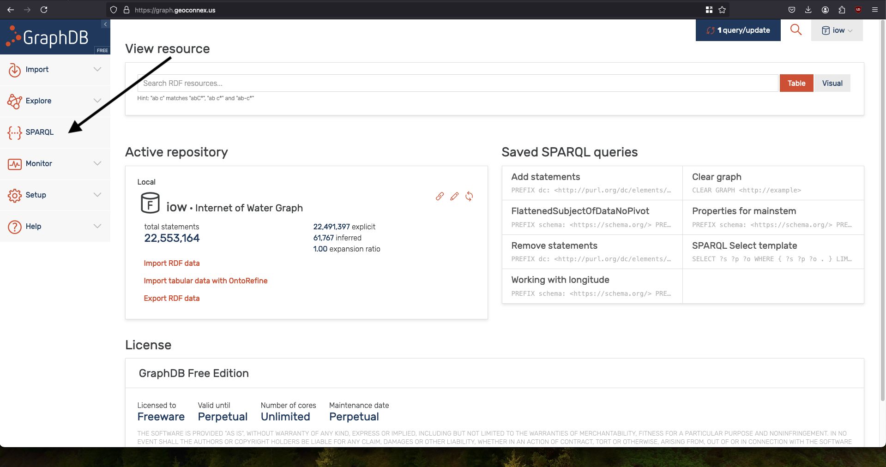
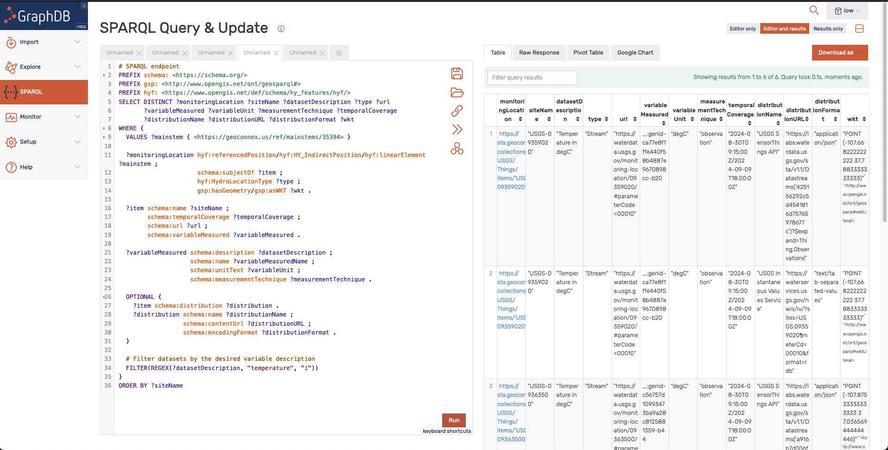

import Tabs from '@theme/Tabs';
import TabItem from '@theme/TabItem';

# Finding datasets related to hydrologic features

The most important use case of the Geoconnex system for data users is to discover datasets related to a given hydrologic feature. This functionality is the reason for implementing a [Knowledge Graph approach](/about/principles). There are two ways we currently offer users to discover datasets:

1. Convenience references to "datasets" within Reference Feature Collections (currently implemented only for `mainstems`)
1. Using the full SPARQL query API for the graph database at https://graph.geoconnex.us

### Convenience "dataset" reference in API

Each mainstem's GeoJSON response includes a nested array within the "datasets" attribute which can be extracted. In the example below, 58 datasets are available about the Animas River. These can be filtered further to get datasets on specific variables like temperature or turbidity.

<Tabs groupId="lang">

<TabItem value="R" label="R" default>
```r
# Animas River mainstem URI
animas_uri <- "https://geoconnex.us/ref/mainstems/35394"
# Fetch the Animas River data
response <- GET(animas_uri, query = list(f = "json"))
animas_data <- content(response, "text") |> fromJSON()

# Extract datasets
datasets <- animas_data$properties$datasets
datatable(datasets,
          options = list(pageLength = 5, scrollX = TRUE,
                         search = list(regex=TRUE, caseInsensitive = TRUE, search = 'temperature')
                         )
          )
```
</TabItem>

  <TabItem value="python" label="Python">
```py
# Animas River mainstem URI
animas_uri = "https://geoconnex.us/ref/mainstems/35394"

# Fetch the Animas River data

response = requests.get(animas_uri, params={'f': 'json'})
animas_data = response.json()

# Extract datasets

datasets = animas_data['properties']['datasets']

# Create a DataFrame

df_datasets = pd.DataFrame(datasets)

# Display the DataFrame with options similar to datatable in R

df_datasets.head(5) # Display the first 5 rows

```
</TabItem>
</Tabs>

```
| monitoringLocation                                        | siteName      | datasetDescription                                           | type   | url                                                        | variableMeasured                               | variableUnit | measurementTechnique | temporalCoverage                                | distributionName                     | distributionURL                                           | distributionFormat                  | wkt                                              |
|----------------------------------------------------------|---------------|------------------------------------------------------------|--------|------------------------------------------------------------|-------------------------------------------------|--------------|----------------------|--------------------------------------------------|--------------------------------------|-----------------------------------------------------------|-------------------------------------|---------------------------------------------------|
| https://sta.geoconnex.dev/collections/USGS/Thi...      | USGS-09363500 | [Turbidity, FNU / USGS-09363500-1f7260408f1d4c...       | Stream | https://waterdata.usgs.gov/monitoring-location...        | Turbidity                                     | _FNU         | observation          | 2024-08-30T09:15:00Z/2024-09-09T18:00:00Z      | USGS Instantaneous Values Service   | https://waterservices.usgs.gov/nwis/iv/?sites=... | text/tab-separated-values            | POINT (-107.87533333333333 37.036569444444446)   |
| https://sta.geoconnex.dev/collections/USGS/Thi...      | USGS-09363500 | [Turbidity, FNU / USGS-09363500-1f7260408f1d4c...       | Stream | https://waterdata.usgs.gov/monitoring-location...        | Turbidity                                     | _FNU         | observation          | 2024-08-30T09:15:00Z/2024-09-09T18:00:00Z      | USGS SensorThings API               | https://labs.waterdata.usgs.gov/sta/v1.1/Datas...  | application/json                    | POINT (-107.87533333333333 37.036569444444446)   |
| https://sta.geoconnex.dev/collections/USGS/Thi...      | USGS-09363500 | Specific cond at 25C / USGS-09363500-252c7ef5e...        | Stream | https://waterdata.usgs.gov/monitoring-location...        | Specific cond at 25C / USGS-09363500-252c7ef5e... | uS/cm       | observation          | 2024-08-30T09:15:00Z/2024-09-09T18:00:00Z      | USGS Instantaneous Values Service   | https://waterservices.usgs.gov/nwis/iv/?sites=... | text/tab-separated-values            | POINT (-107.87533333333333 37.036569444444446)   |
| https://sta.geoconnex.dev/collections/USGS/Thi...      | USGS-09363500 | Specific cond at 25C / USGS-09363500-252c7ef5e...        | Stream | https://waterdata.usgs.gov/monitoring-location...        | Specific cond at 25C / USGS-09363500-252c7ef5e... | uS/cm       | observation          | 2024-08-30T09:15:00Z/2024-09-09T18:00:00Z      | USGS SensorThings API               | https://labs.waterdata.usgs.gov/sta/v1.1/Datas...  | application/json                    | POINT (-107.87533333333333 37.036569444444446)   |
| https://sta.geoconnex.dev/collections/USGS/Thi...      | USGS-09363500 | None / USGS-09363500-3177e767c0af430b9efae7195...        | Stream | https://waterdata.usgs.gov/monitoring-location...        | None / USGS-09363500-3177e767c0af430b9efae7195... | in           | observation          | 2024-08-30T09:15:00Z/2024-09-09T18:00:00Z      | USGS Instantaneous Values Service   | https://waterservices.usgs.gov/nwis/iv/?sites=... | text/tab-separated-values            | POINT (-107.87533333333333 37.036569444444446)   |
```

### SPARQL

For those who wish to make SPARQL queries directly, the endpoint is https://graph.geoconnex.us.

The Geoconnex graph database provides a RDF4J API that is documented [here](https://graph.geoconnex.us/webapi). With this API, you can run sparql queries from any client that can send HTTP requests.

For example, one can query the graph for all datasets `schema:about` monitoring locations that are on (`<hyf:referencedPosition/hyf:HY_IndirectPosition/hyf:linearElement>`) the Animas River, that have a value for the `schema:variableMeasured` that includes the string "temperature".

<Tabs groupId="lang">
  <TabItem value="query" label="R" default>

```r
# SPARQL endpoint
endpoint <- "https://graph.geoconnex.us"
# Revised SPARQL query
query <- 'PREFIX schema: <https://schema.org/>
PREFIX gsp: <http://www.opengis.net/ont/geosparql#>
PREFIX hyf: <https://www.opengis.net/def/schema/hy_features/hyf/>
SELECT DISTINCT ?monitoringLocation ?siteName ?datasetDescription ?type ?url
       ?variableMeasured ?variableUnit ?measurementTechnique ?temporalCoverage
       ?distributionName ?distributionURL ?distributionFormat ?wkt
WHERE {
  VALUES ?mainstem { <https://geoconnex.us/ref/mainstems/35394> }

  ?monitoringLocation hyf:referencedPosition/hyf:HY_IndirectPosition/hyf:linearElement ?mainstem ;
                      schema:subjectOf ?item ;
                      hyf:HydroLocationType ?type ;
                      gsp:hasGeometry/gsp:asWKT ?wkt .

  ?item schema:name ?siteName ;
        schema:temporalCoverage ?temporalCoverage ;
        schema:url ?url ;
        schema:variableMeasured ?variableMeasured .

  ?variableMeasured schema:description ?datasetDescription ;
                    schema:name ?variableMeasuredName ;
                    schema:unitText ?variableUnit ;
                    schema:measurementTechnique ?measurementTechnique .

  OPTIONAL {
    ?item schema:distribution ?distribution .
    ?distribution schema:name ?distributionName ;
                  schema:contentUrl ?distributionURL ;
                  schema:encodingFormat ?distributionFormat .
  }

  # Filter datasets by the desired variable description
  FILTER(REGEX(?datasetDescription, "temperature", "i"))
}
ORDER BY ?siteName
'
# Execute the SPARQL query
response <- GET(
  url = endpoint,
  query = list(query = query),
  accept("application/sparql-results+json")
)
# Parse the JSON response
  result <- content(response, "text", encoding = "UTF-8") %>% fromJSON()

  # Extract the results
  datasets <- as.data.frame(result$results$bindings) |>
    mutate(across(everything(), ~.$value))

  datatable(datasets)
```

</TabItem>

  <TabItem value="python" label="Python">
  ```python
import requests
import json
import pandas as pd

# SPARQL endpoint
endpoint = "https://graph.geoconnex.us"

# Revised SPARQL query
query = """
PREFIX schema: <https://schema.org/>
PREFIX gsp: <http://www.opengis.net/ont/geosparql#>
PREFIX hyf: <https://www.opengis.net/def/schema/hy_features/hyf/>
SELECT DISTINCT ?monitoringLocation ?siteName ?datasetDescription ?type ?url
       ?variableMeasured ?variableUnit ?measurementTechnique ?temporalCoverage
       ?distributionName ?distributionURL ?distributionFormat ?wkt
WHERE {
  VALUES ?mainstem { <https://geoconnex.us/ref/mainstems/35394> }

  ?monitoringLocation hyf:referencedPosition/hyf:HY_IndirectPosition/hyf:linearElement ?mainstem ;
                      schema:subjectOf ?item ;
                      hyf:HydroLocationType ?type ;
                      gsp:hasGeometry/gsp:asWKT ?wkt .

  ?item schema:name ?siteName ;
        schema:temporalCoverage ?temporalCoverage ;
        schema:url ?url ;
        schema:variableMeasured ?variableMeasured .

  ?variableMeasured schema:description ?datasetDescription ;
                    schema:name ?variableMeasuredName ;
                    schema:unitText ?variableUnit ;
                    schema:measurementTechnique ?measurementTechnique .

  OPTIONAL {
    ?item schema:distribution ?distribution .
    ?distribution schema:name ?distributionName ;
                  schema:contentUrl ?distributionURL ;
                  schema:encodingFormat ?distributionFormat .
  }

  # Filter datasets by the desired variable description
  FILTER(REGEX(?datasetDescription, "temperature", "i"))
}
ORDER BY ?siteName
"""

# Execute the SPARQL query
response = requests.get(
    endpoint,
    params={'query': query},
    headers={'Accept': 'application/sparql-results+json'}
)

# Parse the JSON response
result = response.json()

# Extract the results
bindings = result['results']['bindings']
datasets = pd.json_normalize(bindings)

datasets
  ```

  </TabItem>


    <TabItem value="cli" label="Shell">

    ```sh
    #!/bin/bash

# Define the SPARQL query
read -r -d '' SPARQL_QUERY << EOM
PREFIX schema: <https://schema.org/>
PREFIX gsp: <http://www.opengis.net/ont/geosparql#>
PREFIX hyf: <https://www.opengis.net/def/schema/hy_features/hyf/>
SELECT DISTINCT ?monitoringLocation ?siteName ?datasetDescription ?type ?url
       ?variableMeasured ?variableUnit ?measurementTechnique ?temporalCoverage
       ?distributionName ?distributionURL ?distributionFormat ?wkt
WHERE {
  VALUES ?mainstem { <https://geoconnex.us/ref/mainstems/35394> }

  ?monitoringLocation hyf:referencedPosition/hyf:HY_IndirectPosition/hyf:linearElement ?mainstem ;
                      schema:subjectOf ?item ;
                      hyf:HydroLocationType ?type ;
                      gsp:hasGeometry/gsp:asWKT ?wkt .

  ?item schema:name ?siteName ;
        schema:temporalCoverage ?temporalCoverage ;
        schema:url ?url ;
        schema:variableMeasured ?variableMeasured .

  ?variableMeasured schema:description ?datasetDescription ;
                    schema:name ?variableMeasuredName ;
                    schema:unitText ?variableUnit ;
                    schema:measurementTechnique ?measurementTechnique .

  OPTIONAL {
    ?item schema:distribution ?distribution .
    ?distribution schema:name ?distributionName ;
                  schema:contentUrl ?distributionURL ;
                  schema:encodingFormat ?distributionFormat .
  }

  FILTER(REGEX(?datasetDescription, "temperature", "i"))
}
ORDER BY ?siteName
EOM

# URL encode the query so we can send it as a URL parameter
ENCODED_QUERY=$(python3 -c "import urllib.parse; print(urllib.parse.quote('''$SPARQL_QUERY'''))")

# Define the endpoint URL
ENDPOINT="https://graph.geoconnex.us?query=$ENCODED_QUERY"

# Send the query as a GET request by using URL parameters and encoding the query
curl -X GET --header 'Accept: application/sparql-results+json' "$ENDPOINT"

# Send the query as a POST request by using the query in the body
curl -X POST --header 'Accept: application/sparql-results+json' --header 'Content-Type: application/sparql-query' --data "$SPARQL_QUERY" "$ENDPOINT"
    ```

</TabItem>

  <TabItem value="editor" label="Graphically">
  The Geoconnex graph's website contains a sparql editor. The autocomplete functionality and GUI may make it faster to iterate if you are primarily focused on downloading specific datasets.     

  Navigate to the [Sparql Editor](https://graph.geoconnex.us/sparql) on the sidebar.
   [](https://graph.geoconnex.us/sparql)

Paste your query and click "run".
Results are then output as a table that can be exported in a variety of formats such as CSV or JSON.


</TabItem>

</Tabs>


