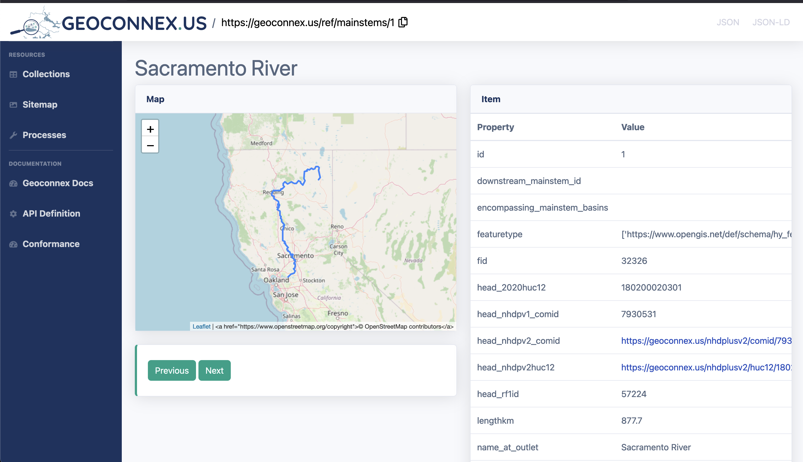
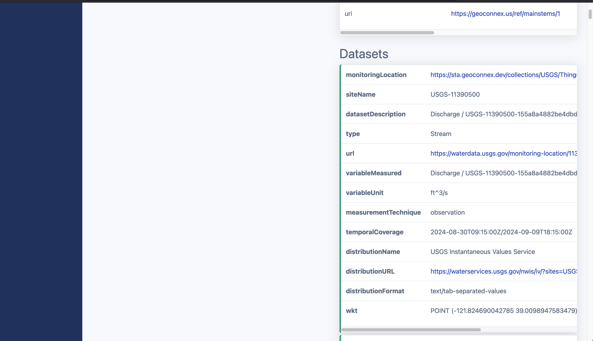

# Access the full Geoconnex graph

The Geoconnex Graph enables the discovery of datasets linked to geospatial features, including reference features such as mainstems. 

## Retrieving data from the `datasets` section

One of the key sections to explore when accessing a feature's landing page or JSON response is the `datasets` section, which contains records of various datasets and metadata associated with the feature you are exploring. These datasets often represent monitoring locations or other observational data, and they provide key information to help you understand the environmental or hydrological characteristics of the area.

import Tabs from '@theme/Tabs';
import TabItem from '@theme/TabItem';

### An example: getting datasets for the Sacramento River
<Tabs>
  <TabItem value="query" label="Getting datasets via the UI" default>
  To look for all datasets associated with the mainstem 1, we can go to [geoconnex.us/ref/mainstems/1](https://geoconnex.us/ref/mainstems/1). This is the reference feature page for Sacramento River. On this page it will contain both information about the mainstem and the datasets associated with it.

    When we scroll down to the `datasets` section, we can see all the datasets associated with the mainstem 1. The first dataset contains the following `distributionURL` which we can use to download the dataset from its provider. 

    ```
    distributionURL https://waterservices.usgs.gov/nwis/iv/?sites=USGS:11390500#parameterCd=00060&format=rdb
    ```



    </TabItem>


      <TabItem value="json" label="Getting datasets Programmatically" default>
    
        To programmatically get the JSON metadata for the associated datasets, you can use any programming language to request the data for the item of your choice, and specify `?f=json` at the end of the URL.

        For instance, if one wanted to use bash and get metadata regarding the first dataset for mainstem 1, you could do the following:

        ```bash
        curl -L 'https://geoconnex.us/ref/mainstems/1' | jq .properties.datasets[0]
        ```
        ```json
        {
            "monitoringLocation": "https://sta.geoconnex.dev/collections/USGS/Things/items/'USGS-11390500'",
            "siteName": "USGS-11390500",
            "datasetDescription": "Discharge / USGS-11390500-155a8a4882be4dbd8cd0739f9614f3ca",
            "type": "Stream",
            "url": "https://waterdata.usgs.gov/monitoring-location/11390500/#parameterCode=00060",
            "variableMeasured": "Discharge / USGS-11390500-155a8a4882be4dbd8cd0739f9614f3ca",
            "variableUnit": "ft^3/s",
            "measurementTechnique": "observation",
            "temporalCoverage": "2024-08-30T09:15:00Z/2024-09-09T18:15:00Z",
            "distributionName": "USGS Instantaneous Values Service",
            "distributionURL": "https://waterservices.usgs.gov/nwis/iv/?sites=USGS:11390500¶meterCd=00060&format=rdb",
            "distributionFormat": "text/tab-separated-values",
            "wkt": "POINT (-121.824690042785 39.0098947583479)"
        }
        ```

    </TabItem>
    
</Tabs>


### Explanation of Key Attributes in the Datasets Section

| Attribute | Description |
| --- | --- |
| Monitoring Location | Links to the URL of a specific monitoring location, such as a sensor or station that collects environmental data. |
| Site Name | The identifier or name of the monitoring site. It typically includes a unique code or description of the location. |
| Dataset Description | Provides a summary of the dataset, often including the type of data being collected (e.g., discharge, water level, temperature) and any relevant metadata. |
| Variable Measured | The type of variable being observed, such as discharge, water temperature, or precipitation. |
| Measurement Technique | Describes how the variable is being measured, providing insight into the methods or instruments used to gather data. |
| Temporal Coverage | The time range for which the data is available. This attribute defines the start and end times of the dataset's observation period. |

