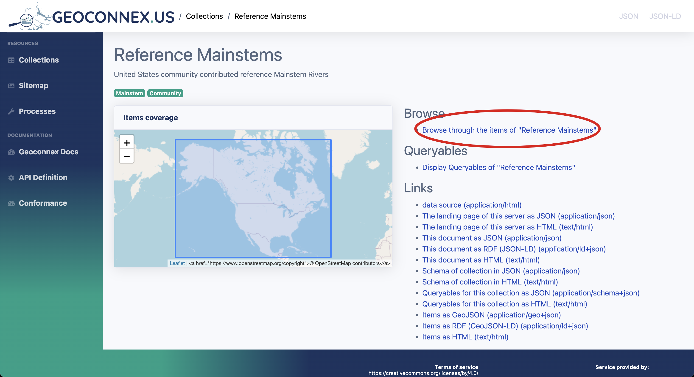

# Access in Browser

OGC API compliant servers, such as [reference.geoconnex.us](https://reference.geoconnex.us), serve HTML representations of all features in the server. This means all Reference Features have an HTML landing page with related information, making it easy to explore and access data without specialized software.


import Tabs from '@theme/Tabs';
import TabItem from '@theme/TabItem';

<Tabs>
  <TabItem value="query" label="Exploring the Reference Feature Server" default>


1. **Open your web browser** and navigate to the [Reference Feature Server](https://reference.geoconnex.us).

1. **Browse collections**
   

2. **Select a collection**: On the landing page, you will see a list of collections. Each collection represents a group of geospatial     features (e.g., mainstems, states, or aquifers). Choose a collection of interest by clicking on it.
   

4. **Browse collection items**: Once in a collection, you can browse individual items (features).
   

5. **View individual item details**: Clicking on an individual item on the map or table will bring you to a detailed landing page.
   

6. **Download or access data**: Examine the feature of interest.
   
</TabItem>
  <TabItem value="ui" label="Getting datasets via the UI" default>
  To look for all datasets associated with the mainstem 1, we can go to [geoconnex.us/ref/mainstems/1](https://geoconnex.us/ref/mainstems/1). This is the reference feature page for Sacramento River. On this page it will contain both information about the mainstem and the datasets associated with it.

    When we scroll down to the `datasets` section, we can see all the datasets associated with the mainstem 1. The first dataset contains the following `distributionURL` which we can use to download the dataset from its provider. 

    ```
    distributionURL: https://waterservices.usgs.gov/nwis/iv/?sites=USGS:11390500#parameterCd=00060&format=rdb
    ```


## Explanation of Key Attributes in the Datasets Section

| Attribute | Description |
| --- | --- |
| Monitoring Location | Links to the URL of a specific monitoring location, such as a sensor or station that collects environmental data. |
| Site Name | The identifier or name of the monitoring site. It typically includes a unique code or description of the location. |
| Dataset Description | Provides a summary of the dataset, often including the type of data being collected (e.g., discharge, water level, temperature) and any relevant metadata. |
| Variable Measured | The type of variable being observed, such as discharge, water temperature, or precipitation. |
| Measurement Technique | Describes how the variable is being measured, providing insight into the methods or instruments used to gather data. |
| Temporal Coverage | The time range for which the data is available. This attribute defines the start and end times of the dataset's observation period. |

    </TabItem>

</Tabs>

