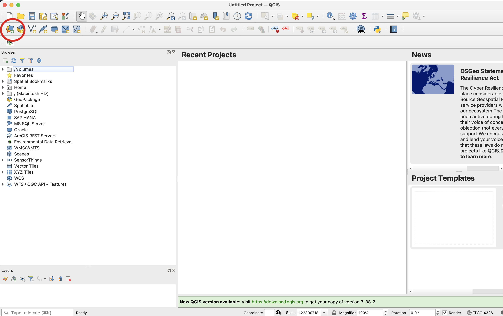
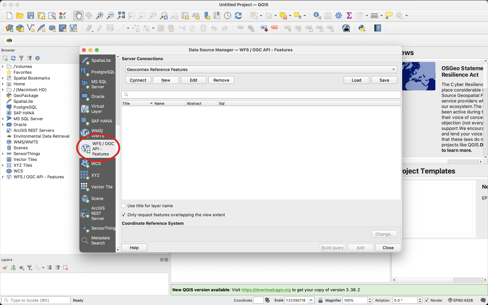
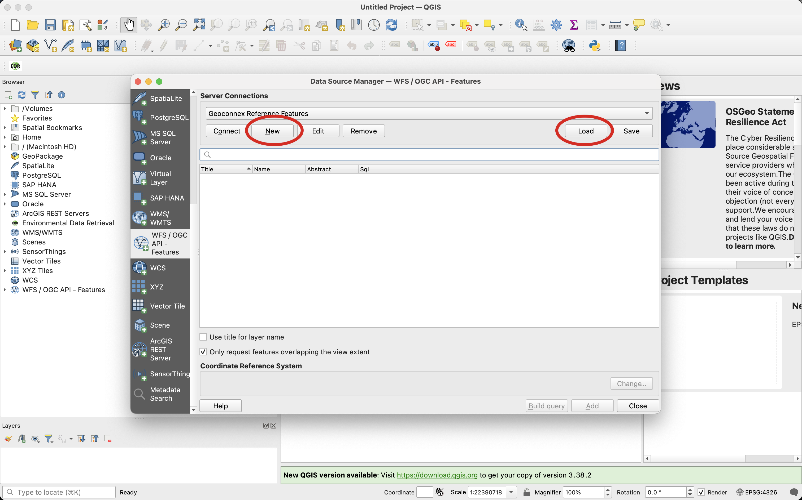
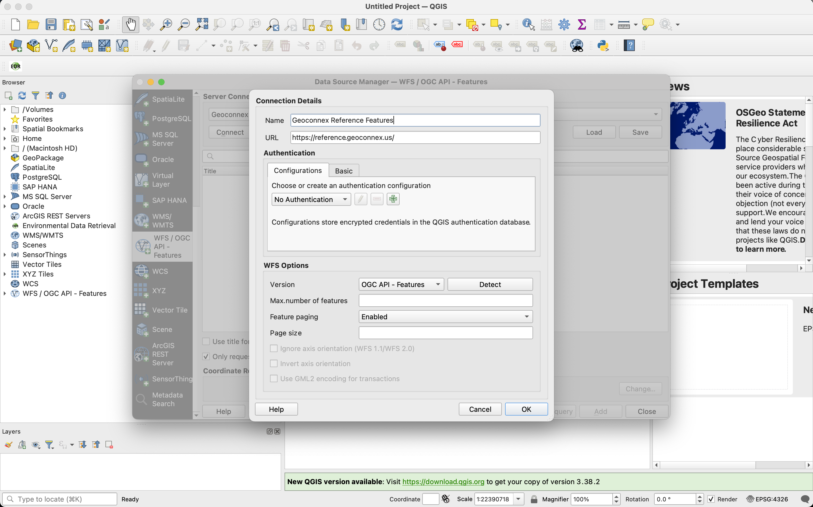
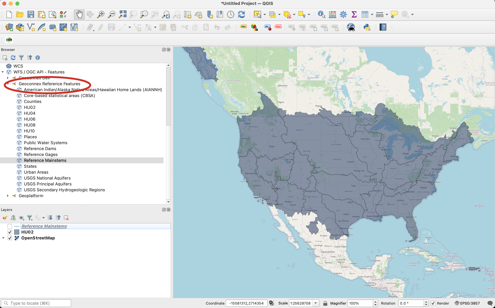

# Access with QGIS and ArcGIS

You can easily add and explore data from OGC API - Feature servers in both **QGIS** and **ESRI ArcGIS**. OGC API compliant servers, such as [reference.geoconnex.us](https://reference.geoconnex.us), allow seamless integration of geospatial data into your GIS workflows.

## Using QGIS

1. **Open QGIS** and navigate to the **Layer** menu.
   

2. Select **WFS / OGC API - Features** from the available options.
   

3. **Add the server connection** by selecting **New**.  
   OR  
   **Download** the [configuration file](./assets/reference-feature.xml) by selecting **Load** to automatically set up the QGIS connection.
   

4. Enter the URL of the OGC API - Features server (`https://reference.geoconnex.us`).  
   

5. Add Features to your map.
   

---

## Using ArcGIS

1. **Open ArcGIS** and go to the **Catalog** pane.

2. Right-click **GIS Servers** and select **Add OGC API - Features (WFS)**.

3. Enter the URL of the OGC API - Feature server (e.g., `https://reference.geoconnex.us`), and add the connection.

4. Browse and add layers from the server into your ArcGIS project.

Now you're ready to explore the data directly within your GIS application!
