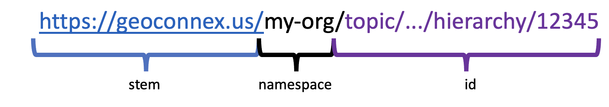

---

sidebar_position: 1
title: Identification Scheme
---

# Establish an Identification Scheme for your Data

The first thing to do is establish an identification scheme for the features/locations represented in your data. 
    - Identifiers should be unique, unambiguous, and persistent to changes. 
    - That is, if your organization uses some kind of numbering or naming system that is vulenrable to periodic changes, identifiers should not be based on that system. The real-world feature should have a persistent, stable identifier. Furthermore, to participate in the geoconnex system, identifiers should have a stem, namespace, and id. 

<figure>

<i>
<figcaption>An example id scheme</figcaption>
</i>

</figure>

Note that it looks like a URL. This is because these identifiers are meant to resolve (redirect) to a [landing page](https://docs.geoconnex.us/principles/lc.html) about the identified locations. This means that all elements must be allowed URL characters, and in practice, should avoid obscure symbols and whitespace. 

The stem (beginning) should always be `https://geoconnex.us`. The ***namespace*** should be a relatively short and easy-to-read name for grouping of identifiers that you have the authority to manage. This is often the name or abbreviated name of an organization, such as `/epa/`, `/usgs/`. 

:::tip

To view namespaces already in use visit https://reference.geoconnex.us/stac/sitemap

:::

After the namespace, you have relative freedom to assign identifiers, as long as each feature/location has a unique identifier. You may wish to create an identification scheme with a topic hierarchy. For example, subdividing between surface water and groundwater monitoring locations with `/sw-sites/` and `/wells/`.

 You can use as many slashes, dashes, or other separators as you wish, and use upper and lowercase alphanumeric characters, as long as the resulting identifier is a valid URL. For example, you could have `https://geoconnex.us/organization/sites/surface/waterquality/1234` and `https://geoconnex.us/organization/sites/groundwater/injection/ABCD`

Once you have established an indentifier scheme and assigned each of your features/locations with a unique identifier, you can begin preparing your data for publication in the [next step](../step-2/index.md)

